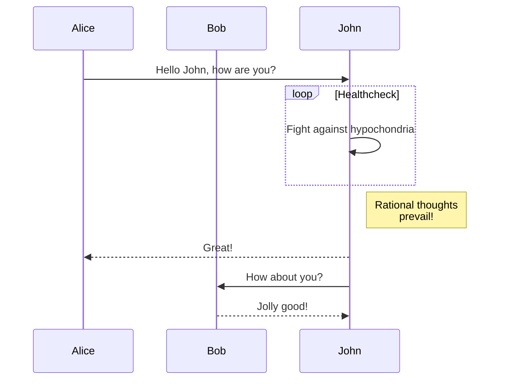
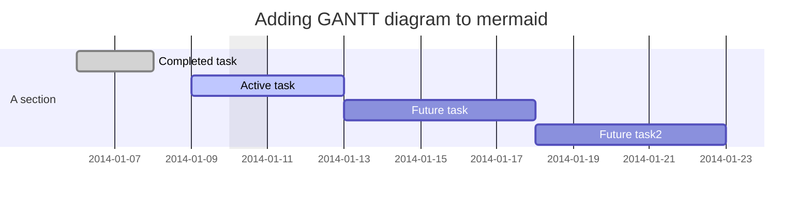
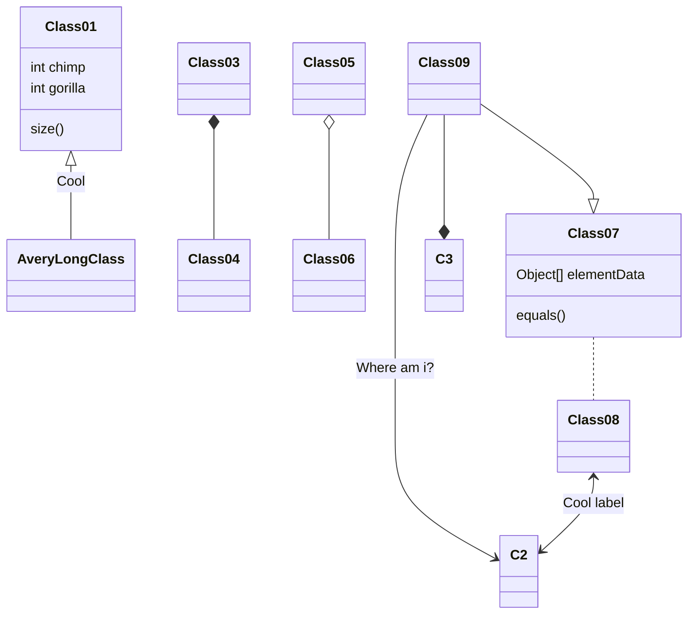

# Mermaid

https://mermaid-js.github.io/mermaid/#/

## 代码块

- 相关代码需要置于 mermaid 代码块中，类似于：

```
    ```mermaid
    graph TD;
        A-->B;
        A-->C;
        B & C -->D;
    ```
```

## Flowchart

> https://mermaid-js.github.io/mermaid/#/flowchart

```
graph TD;
    A-->B;
    A-->C;
    B & C -->D;
```


- `TD` 表示 `Top` -> `Down`
- 类似的还有 `DT` `LR` `RL`
- `D` 亦可替换为 `B`，如 `TB` `BT`
- 形状
  ```mermaid
  graph
    n[node]
    rn([round-node])
    srn[[subroutine-node]]
    csn[(cylindrical-node)]
  ```
  ```mermaid
  graph
    cn((cricle-node))
    asn>asymmetric-shape-node]
    rbn{rhombus-node}
    hn{{hexagon-node}}
  ```
  ```mermaid
  graph
    pn[/parallelogram-node/]
    pna[\parallelogram-alt-node\]
    tn[/trapezoid\]
    tna[\trapezoid/]
  ```

## Sequence diagram

```
sequenceDiagram
    participant Alice
    participant Bob
    Alice->>John: Hello John, how are you?
    loop Healthcheck
        John->>John: Fight against hypochondria
    end
    Note right of John: Rational thoughts <br/>prevail!
    John-->>Alice: Great!
    John->>Bob: How about you?
    Bob-->>John: Jolly good!
```



## Gantt diagram

```
gantt
dateFormat  YYYY-MM-DD
title Adding GANTT diagram to mermaid
excludes weekdays 2014-01-10

section A section
Completed task            :done,    des1, 2014-01-06,2014-01-08
Active task               :active,  des2, 2014-01-09, 3d
Future task               :         des3, after des2, 5d
Future task2               :         des4, after des3, 5d
```



## Class diagram -: experimental

```
classDiagram
Class01 <|-- AveryLongClass : Cool
Class03 *-- Class04
Class05 o-- Class06
Class07 .. Class08
Class09 --> C2 : Where am i?
Class09 --* C3
Class09 --|> Class07
Class07 : equals()
Class07 : Object[] elementData
Class01 : size()
Class01 : int chimp
Class01 : int gorilla
Class08 <--> C2: Cool label
```



## Git graph -: experimental

```
gitGraph:
options
{
    "nodeSpacing": 100,
    "nodeRadius": 10
}
end
commit
branch newbranch
checkout newbranch
commit
commit
checkout master
commit
commit
merge newbranch
```


